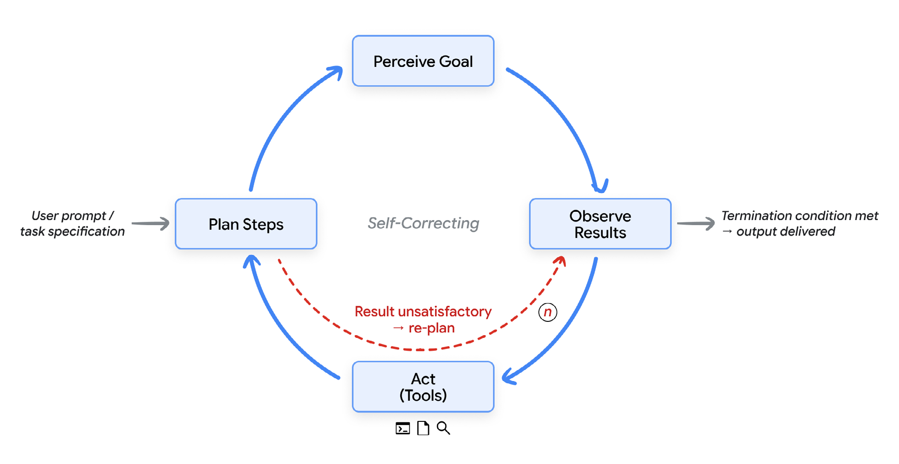
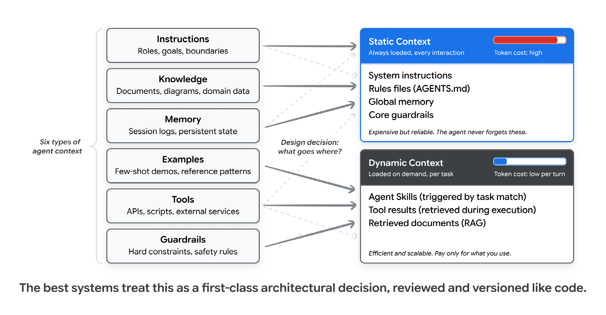
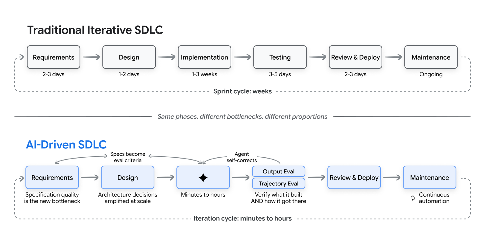
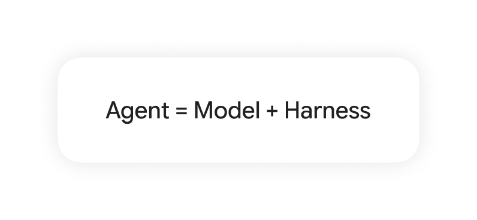
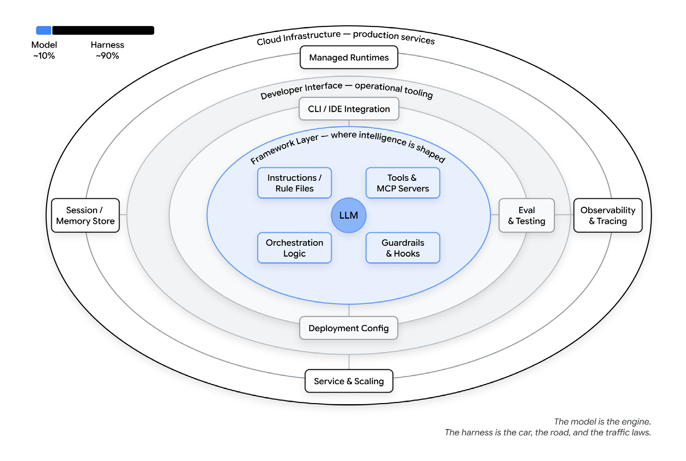
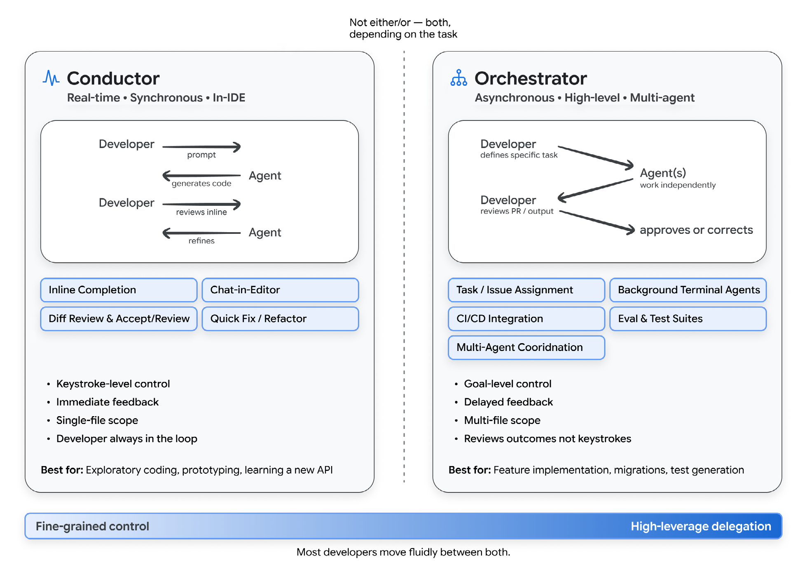
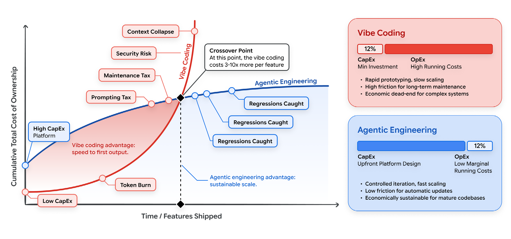

# 新版軟體開發生命週期與 Vibe Coding

> **作者：** Addy Osmani、Shubham Saboo、Sokratis Kartakis  
> **副標題：** 從即興提示到代理式工程

* * *

## 誌謝

* **內容貢獻者：** Elia Secchi、Julia Wiesinger、Anant Nawalgaria
* **策展與編輯：** Anant Nawalgaria
* **設計：** Michael Lanning

* * *

## 目錄

1. 引言  
2. 為何此文、為何現在  
3. 適用讀者  
4. AI 代理簡介  
5. 何謂 vibe coding？  
6. 光譜：從 vibe coding 到代理式工程  
7. 情境工程  
8. 新的軟體開發生命週期  
9. Harness 工程  
10. 開發者角色的演變：指揮家與編排者  
11. Coding Agents 實踐  
12. 量產代理與多代理工作流  
13. AI 開發經濟學  
14. 從何開始  
15. 結論：意圖即介面  
16. 註解

* * *

## 引言

軟體開發長久以來是對問題與解法的翻譯：先用人類可理解的抽象架構，後用機器可執行的語法。每個步驟都有摩擦，而這些摩擦正在瓦解。 **真正的變革不是某個新語言或框架，而是從「撰寫程式」轉向「表達意圖」，相信智慧系統會把意圖化為可運作的軟體。**

幾十年來，開發者與計算機的介面是語法：大括號、分號、型別與精確文法。今天這個時代終結了。開發者描述「要做什麼」，而不是「怎麼做」，機器負責實作，人類負責判斷與架構。到 2026 年初，估計 85% 的專業開發者定期使用 AI 程式代理人，51% 每天使用，約 41% 的新程式碼由 AI 產生。

這場變革循序漸進：從編輯器的自動補全、完成整個函式的內嵌建議，到聊天式介面可用自然語言定義功能。如今，全自動代理可克隆儲存庫、規劃多檔案變更、在沙箱執行與測試，最後提交 pull request——不必人類敲下一行程式碼。

* * *

## 為何此文、為何現在

工具、能力與範式以週為單位快速演進。工程團隊需要一套不易過時的心智模型來理解這個版圖——本白皮書提供這樣的框架，方便在具體工具更迭後仍能應用。

## 適用讀者

本文面向希望理解 AI 如何改變軟體開發生命週期並在保持可靠性前提下採用這些能力的工程師、經理、架構師與技術領導者。我們假設讀者熟悉現代開發實踐，但不一定熟悉 AI 與機器學習。

* * *

## AI 代理簡介

AI 代理是一種能感知目標、規劃、執行並迭代的軟體系統。

> [!NOTE]
> **AI 代理與傳統聊天機器人的本質區別：**
> 代理不僅僅是「一問一答」，而是在持續的 **「感知 → 計畫 → 行動 → 觀察」** 閉合迴圈中自主運作。

代理由以下五個核心部分構成：

1. **模型**：大型語言模型是推理引擎。  
2. **工具**：連接模型與世界的 API、指令與服務。  
3. **記憶**：保存會話狀態或持久資料。  
4. **編排**：在每個迭代組裝上下文並決定下一步。  
5. **部署**：運行環境與雲端基礎設施。

這些部件共同實現長程任務，與只回應一次的聊天機器人區別明顯。

下圖展示代理迴圈「感知→計畫→行動→觀察→迭代」的運作流程：

## 何謂 vibe coding？

2025 年 2 月，Andrej Karpathy 將一種新編程方式稱為「vibe coding」：開發者用自然語言描述需求，接受 AI 輸出，如有錯誤再把錯誤訊息貼回去請 AI 修正。這種模式迅速風靡，成為所有 AI 輔助開發的通稱，但也讓概念變得模糊。2026 年初，Karpathy 提出「代理式工程（agentic engineering）」一詞，指更有紀律的另一端。

## 光譜：從 vibe coding 到代理式工程

這兩種模式位於同一光譜。差異不在是否使用 AI，而在於**驗證的嚴格程度**。在 vibe coding 中，開發者僅透過執行程式「看起來能跑就算過關」；在代理式工程中，每個輸出都有測試與評估檢驗：測試確保可預期行為，評估檢查代理的工具調用及品質。沒有這兩道關卡，再複雜的提示仍只是 vibe coding。

| 比較面向 | Vibe Coding | 結構化 AI 輔助 | 代理式工程 (Agentic Engineering) |
| :--- | :--- | :--- | :--- |
| **意圖規範** | 隨性、模糊的自然語言提示 | 包含範例與限制條件的精細提示 | 正式規格書、架構文件與記憶檔 |
| **驗證機制** | 「看起來能跑就行」的手動驗證 | 手動測試、隨機抽查 | 自動化測試、CI/CD 評估、多模型審核 |
| **讀碼深度** | 幾乎不看產出的程式碼 | 選擇性、局部查看 | 理解系統架構全覽，僅審查核心邏輯 |
| **錯誤處理** | 將報錯貼回，依賴 AI 反覆試錯 | 人類分析根本原因，AI 負責編寫修補 | 代理自主偵測與修正；人類介入架構調整 |
| **適用範圍** | 原型設計、PoC、個人玩具專案 | 既有程式庫、單一模組的功能擴充 | 生產級大型系統、團隊規模協作開發 |
| **風險等級** | **高**；容易產生一次性「義大利麵」程式 | **中**；具備人工監督的守門機制 | **低**；每階段均有自動化驗證與防護網 |

* * *

## 情境工程：讓 AI 理解上下文

經驗顯示，**AI 生成程式碼的品質更依賴上下文，而非提示技巧**。情境工程致力於為代理提供與人類同等豐富的背景，包含六類元素：

* 📋 **指令 (Instructions)**：明確定義代理的角色、任務目標與安全邊界。
* 📖 **知識 (Knowledge)**：相關文件、系統架構圖、領域專業資料。
* 💾 **記憶 (Memory)**：會話紀錄、歷史上下文與持久化狀態。
* 🧪 **範例 (Examples)**：用於 Few-Shot 學習的示範程式與輸出模式。
* 🛠️ **工具 (Tools)**：代理可呼叫的 API、終端指令與外部整合服務。
* 🛡️ **護欄 (Guardrails)**：硬性限制、格式規範與安全策略。

決定哪些應永遠存在於靜態上下文、哪些按需動態載入，是情境工程的核心。技能（skills）模式將程式知識封裝為模組，按任務需要才載入，降低提示長度並提升一次成功率。下圖概述靜態與動態上下文的權衡：

* * *

## 新的軟體開發生命週期

### 傳統 SDLC 的壓力

敏捷與持續整合將瀑布式流程縮短到週期。**AI** 進一步將迭代週期從「週」壓縮到「分鐘」，但壓縮並不均勻：實作時間大幅減少，需求、設計與驗證仍需人類判斷。結果不是更快的傳統流程，而是不同的工作型態：階段界線模糊，開發者從「實作者」轉成「系統設計者與品質裁判」。下圖對比傳統迭代 SDLC 與 AI 驅動的流程：

### AI 如何改變各階段

- **需求與規劃**：AI 可從產品簡報生成使用者故事，識別遺漏的邊界條件，從自然語言產生 API 結構，甚至生成互動原型。需求不再只是文件，而是人與 AI 同步演化的對話。
- **設計與架構**：架構涉及一致性、擴展性與買／建取捨，仍需人類決策。但給定明確架構文件，代理可生成應用骨架，確保新程式碼遵循既定慣例。
- **實作**：現代程式代理能從描述生成整個功能與多檔案變更。調查顯示 AI 助理可提高 25–39% 生產力，但熟練開發者可能因需要驗證 AI 輸出而耗時更長。
- **測試與品質保證**：AI 生成程式碼的驗證包括輸出評估（確保結果正確）與軌跡評估（確保使用了正確的工具與邏輯）。建立持續的評估飛輪——對照基準測試、聚類錯誤根因、優化提示及工具——可讓質量隨時間提高。
- **程式碼審查與部署**：AI 可檢查潛在錯誤、風格和安全問題，但不能取代人類對設計與長期維護的判斷。部署流程應結合 AI 驅動的觀察能力，自動監測與回滾失敗。
- **維護與演進**：AI 讓舊程式庫的維護不再畏懼。代理可協助瀏覽與重構技術負債，如遷移框架、更新 API 與現代化測試套件。

### 工廠模型：從生產程式到生產系統

工廠模型視開發者的主要輸出不是程式碼，而是「生產程式碼的系統」。這條生產線包含規格與上下文、生成程式碼的代理、檢測品質的測試與評估、把失敗反饋給代理的迴圈，以及限制代理行為的護欄。開發者設計這條線，確保品質；代理在其中運轉。

* * *

## Harness 工程：模型之外的架構

許多人把模型本身當作完整系統，但真正讓模型完成任務的是包覆在外的**Harness**：提示、工具、上下文政策、鉤子、沙箱、子代理、可觀察性等。它們提供狀態、工具執行、反饋迴圈與可執行的限制。

> [!IMPORTANT]
> **代理 (Agent) = 模型 (Model) + Harness (外包架構)**
> 
> 這張圖表凸顯了模型與其包覆架構的關係：**單純的模型本身並非完整的解決方案**。它必須結合詳盡的提示、精準的工具、動態上下文政策與安全護欄，才能構建出可投入生產環境的可靠代理。

### Harness 元素

- **指令／規則檔**：定義代理是誰、做什麼、不能做什麼（AGENTS.md、技能檔）。  
- **工具**：代理可呼叫的函式、MCP 伺服器與 API，以及調用說明。  
- **沙箱／執行環境**：限制代理能存取的檔案、服務與網路。  
- **編排邏輯**：子代理生成、模型路由與專家分工。  
- **護欄／鉤子**：在特定生命週期點執行的確定性程式，如呼叫前檢查或提交前攔截。  
- **可觀察性**：日誌、追蹤、評估與成本度量。無可觀察性就無法改善代理。

下圖顯示了模型與 Harness 各層級：

代理成功與否更多取決於這些架構元素，而非底層模型。真正的工程工作在模型之外。

* * *

## 開發者角色的演變：指揮家與編排者

隨著 AI 接手更多實作，開發者的角色變化既令人興奮又令人不安。我們將兩種工作模式稱為「指揮家」與「編排者」。

### 指揮家：同步、即時、在 IDE

指揮家模式下，開發者與 AI 共同實作，觀察程式碼即時產生，透過提示與修正引導 AI，維持對每個細節的掌控。這種模式適合：

- 複雜邏輯或疑難排解。  
- 學習新框架或不熟悉的程式庫。  
- 希望保持對每行程式理解時。

GitHub Copilot、Google Gemini Code Assist、Cursor 等工具支援這種模式，提供內嵌補全、聊天介面與即時修改。

### 編排者：非同步、高層、多代理

編排者模式中，開發者在較高抽象層運作：定義目標、指派給代理、審查結果，但不逐行監看。代理可能在背景並行工作，開發者定期檢查與調整。這模式適合：

- 明確任務如 bug 修復或遵循既定模式的功能開發。  
- 整個程式庫遷移。  
- 測試或文件生成。

要有效編排，開發者需具備：

- **規格化**：精確定義任務，使代理可執行且無歧義。  
- **分解**：將大型任務拆分為適合代理處理的單元。  
- **評估**：快速判斷代理輸出是否符合品質。  
- **系統設計**：設計約束、測試與反饋迴圈，使代理保持生產力。

### ⚠️ 80% 問題的警示

AI 代理通常能極其迅速地完成約 **80%** 的核心功能，但剩下的 **20%** —— 包含邊界條件、異常錯誤處理、系統整合點、以及細微的正確性要求 —— 往往需要深厚的人類領域知識。

> [!WARNING]
> **新型態的 AI 錯誤：概念性偏差**
> AI 產出的錯誤正從簡單的「語法錯誤」演變成更為隱蔽的「概念性偏差」（如：錯誤假設商業邏輯、未釐清模糊需求、漏掉極端邊界情況、或做出長期難以維護的架構決策）。
> 
> 這些錯誤極難察覺，因為**程式碼表面上看起來完全正確，甚至能通過基本單元測試**。

因此，開發者的最佳策略是**讓 AI 處理高確定性的明確任務**，而將自身精力高度集中於**需求釐清、架構權衡與嚴格的正確性驗證**。

下圖示意指揮家與編排者模式的差異：

* * *

## Coding Agents 實踐

要將這些模式落實到日常工作，需要理解目前 AI 代理的類型與適用情境。開發者常同時使用三類 coding agent：

1. **編輯器代理**：在 IDE 中提供內嵌補全、聊天面板與即時修改，具有全程式庫意識。這是多數人初次接觸 AI 編程的地方。例：GitHub Copilot、Cursor、Windsurf、JetBrains AI Assistant。  
2. **終端代理**：從命令列啟動，透過自然語言定義目標，具有完整檔案系統存取、多檔案編輯、執行測試與迭代的能力，是目前較嚴肅的 vibe coding 場景。例：Antigravity CLI、Claude Code、Codex CLI、Open Code、Cline。  
3. **背景代理**：在雲端沙箱中自主運行數小時，產生 pull request 等輸出，開發者事後審查。例：Google Jules、GitHub Copilot agent mode、Cursor 背景代理、Google AlphaEvolve。

開發者通常在同一天內使用三種代理：編輯器代理適合流暢寫程式；終端代理適合多檔案工作與探索陌生程式庫；背景代理適合描述清楚可放手的任務。選擇取決於任務，而不是代理的「自治階梯」。

* * *

## 量產代理與多代理工作流

前述討論以利用 coding agents 寫程式為主。但當我們要建構的東西本身就是代理，例如處理退款的客服機器人、整理資訊的研究助理或監控法規遵循的內部工具時，需要更完整的架構：專屬工具、記憶、評估與部署。

今日，這些生產級代理也能透過同一終端工作流完成。Google Agents CLI 是示例：安裝後，開發者可用自然語言指示 coding agent 建立、評估並部署代理。CLI 封裝了從範本架設專案、撰寫 ADK 程式、生成評估集、執行測試、部署到 Agent Runtime，再回報結果的流程。

更進一步，Google 的 Agent Development Kit (ADK) 支援圖形化、多代理工作流與多種互動機制：共享 session 狀態、模型上下文協定 (MCP) 用於工具存取，以及 Agent2Agent (A2A) 協定用於跨代理委派。2026 年初的一次實驗顯示，代理團隊利用此架構在兩週內建出一個 C 編譯器，人類負責方向與審查，代理負責實作。瓶頸從撰寫程式轉為定義需求與驗證結果。

對開發者而言，這代表同樣的 vibe coding 流程今天可產生腳本，明天即可產生生產代理。生命週期（建立、評估、部署、觀察、改進）都發生在一處；從構想到運行代理的時間從數週縮短到數小時，大部分工作透過自然語言完成。將 ADK 與良好的規範、護欄與可觀察性結合，就能建構值得信賴的多代理系統。

* * *

## AI 開發經濟學

討論 AI 對 SDLC 的影響時，多數聚焦「寫程式速度」。但對工程領導者而言，更重要的是****總擁有成本 (TCO, Total Cost of Ownership)****：**資本支出 (CapEx, Capital Expenditure)** 與**營運成本 (OpEx, Operational Expenditure)** 的權衡。以下解析兩種模式的經濟學。

### Vibe Coding 的隱藏債務（低 CapEx，高 OpEx）

Vibe coding 看似成本低廉：訂閱 AI 助手即可開始，幾乎不需要設計系統，CapEx 極低。但其背後藏有高額、複合的 OpEx：

- **代幣燃燒稅**：每次與大型模型交互都依輸入輸出代幣計費。Vibe coding 常將大檔案塞進上下文並重複要求修正，形成昂貴且低成功率的提示循環。  
- **維護稅**：臨時提示生成的程式碼缺乏結構；半年後的 bug 修復需先拆解雜亂無章的「義大利麵」程式。  
- **安全補救**：未經評估的快速生成導致漏洞倍增，生產環境修補的成本遠高於設計階段捕捉。

### 代理式工程的投資（高 CapEx，低 OpEx）

代理式工程反轉了經濟模型。它需要在產生任何生產程式碼前進行 deliberate 投資：設計 API 結構、建立確定性測試套件、構建良好的上下文與護欄。這增加了 CapEx，但邊際維護成本大幅下降——代理在嚴格治理的「工廠」內運作，產生的程式碼結構合理、預先測試並符合標準。

### 情境工程作為財務槓桿

在代幣計價時代，情境工程是財務策略。傳送 100,000 字節的程式庫到模型中不可行。有效的情境工程提供高訊號、密集且小巧的上下文（如 AGENTS.md 與架構護欄），而非雜亂無章的大段提示，藉此提升一次成功率並避免昂貴的試錯循環。

### 動態上下文與技能提升效率

進一步優化 OpEx 需使用動態上下文與技能（skills），即按需呼叫工具或 MCP 伺服器。我們在系列第三篇文章中深入探討此主題。

### 智慧模型路由

代理式工程還允許根據任務複雜度自動路由模型。在 vibe coding 中，開發者通常使用單一大型模型處理所有問題，為簡單任務也付出高昂費用。工廠模型則將複雜任務（需求、架構、初始實作）交給大型模型，將確定性較高的任務（測試生成、程式碼審查、CI/CD 監測）交給較小且便宜的模型，藉此兼顧品質與成本。

* * *

## 從何開始

### 給個人開發者的建議

1. 為專案建立 **AGENTS.md** 或類似檔案，記錄技術棧、慣例、硬性規則與工作流程；代理犯錯時即加入新規則。  
2. 安裝一組技能（如 Agents CLI）為 coding agent 提供建構、評估、部署與優化能力。  
3. 選擇一個重複性工作流程作為第一個代理，例如研究、程式碼審查或定期報告；先用終端代理原型，然後透過 CLI 提升為生產代理。  
4. 在生成程式碼前撰寫測試與評估集，它們比自然語言更精準地傳達意圖。  
5. 審查每一行將要進入生產的程式碼；對看起來巧妙的片段保持懷疑，檢查匯入是否真實，確保錯誤處理覆蓋合理情況。  
6. 維持核心開發技能。AI 處理例行工作，開發者應投資在除錯、系統設計與審查 AI 輸出上。

### 給工程領導者的建議

1. 將情境工程視為一等公民，將 AGENTS.md、系統提示、評估套件與技能庫視為程式碼般審查與版本控制。  
2. 把標準設於評估而非演示；單次 demo 證明代理曾成功，而通過評估套件才能保證長期成功。  
3. 為 AI 生成的程式碼調整審查流程，訓練審查者識別 AI 產生的依賴、錯誤處理不足與細微錯誤。  
4. 明確區分原型與生產工作；清楚規範哪些專案、分支與環境適用 vibe coding，哪些必須採用代理式工程。  
5. 投資 Harness 組件作為團隊共用資產，視為基礎設施；重複使用的系統提示、技能庫、MCP 連線與評估工具需持續改進。

### 給組織的建議

1. 將 AI 輔助開發視為工程投資而非單純提升生產力；結合評估、可觀察性與清晰的架構標準，才能避免技術債堆積。  
2. 在擴張前投資生產基底：在 CI 中運行軌跡與輸出評估、追蹤每次代理執行、設定每個代理的權限與安全審查。  
3. 採用開放標準，如 MCP 用於工具存取、A2A 用於跨代理委派，以保持供應商兼容性並避免將來重構。  
4. 規劃人類與代理混合團隊，調整程式碼審查、值班輪值與團隊結構，使代理成為參與者而非工具。  
5. 重新定義招聘與培訓重點，強調判斷力與規格化能力，而非單純實作速度；最有價值的工程師將是能有效指揮代理的人。

* * *

## 結論：意圖即介面

從語法到意圖的轉變已是現實。開發者花更多時間描述需求而非撰寫細節。SDLC 正因 AI 而被壓縮、重構與再想像。關鍵不在於變革是否發生，而在於個人、團隊與組織如何導航它。

本文提供的心智模型——vibe coding 與代理式工程的光譜、指揮家與編排者的角色、三類 coding agent、工廠模型——將在工具與能力改變後仍然有用。

三個耐久的原則突出：

> [!TIP]
> ### 💡 三大耐久的工程原則
> 
> 1. **結構才能擴展，隨性無法。**
>    Vibe Coding 極其適合用於初期探索、PoC 驗證與原型設計；但對於要投入生產環境的軟體，**代理式工程（正式規格、自動化測試、安全護欄、人類評估）**是不可或缺的基石。
> 
> 2. **AI 放大工程文化 (Amplification Effect)。**
>    擁有強大測試套件、清晰架構規範與嚴格 Code Review 流程的組織，能從 AI 浪潮中獲得最巨大的收益。**AI 會放大你的優點，但同樣也會成倍放大你的系統缺點與壞習慣。**
> 
> 3. **人類角色正在演進，而非消失。**
>    懂系統架構、能精準定義需求與規格、批判性評估代理輸出，並設計有效反饋系統的人才，比以往任何時候都更加珍貴。**工程師的技能重心已從「程式碼編寫（實作）」轉向「架構判斷力與規格定義（指揮）」。**

隨著障礙降低，小團隊將能解決更大問題，個人開發者能建構以往需整個部門維護的系統，軟體開發的大門將更開放。成功的團隊將是那些把 AI 當強力工具又保持工程紀律者。他們理解未來軟體工程不是選邊站，而是設計人類與 AI 各展所長的系統。

* * *

## 註解

1. GetPanto，「[AI 程式助理統計 2025–2026](https://www.getpanto.ai/blog/ai-coding-assistant-statistics)」；Index.dev，「[使用 AI 工具的開發者生產力統計](https://www.index.dev/blog/developer-productivity-statistics-with-ai-tools)」。  
2. Karpathy, A.,「[Vibe Coding](https://x.com/karpathy/status/1886192184808149383)」X/Twitter 貼文，2025 年 2 月；Wikipedia，「[Vibe coding](https://en.wikipedia.org/wiki/Vibe_coding)」。  
3. Osmani, A.,「[代理式工程](https://addyosmani.com/blog/agentic-engineering/)」。  
4. Karpathy, A.,「從 Vibe Coding 到代理式工程」，2026；The New Stack，「[Vibe Coding is Passe](https://thenewstack.io/vibe-coding-is-passe/)」。  
5. Glide Blog，「[何謂代理式工程？](https://www.glideapps.com/blog/what-is-agentic-engineering)」；The New Stack，「[Vibe Coding, Agentic Engineering](https://thenewstack.io/vibe-coding-agentic-engineering/)」。  
6. CircleCI，「[AI-Native SDLC](https://circleci.com/blog/ai-sdlc/)」。  
7. GroovyWeb，「[AI 時代的 SDLC：2026 的軟體開發](https://www.groovyweb.co/blog/sdlc-ai-era-software-development-2026)」；EPAM，「[從傳統軟體到原生 AI SDLC](https://www.epam.com/about/newsroom/in-the-news/2026/from-traditional-software-to-a-native-ai-sdlc-how-genai-is-redefining-engineering)」。  
8. Osmani, A.,「[工廠模型](https://addyosmani.com/blog/factory-model/)」。  
9. Deloitte，「AI 在軟體工程中的生產力收益 2025–2026」，預估全流程提升 30–35%。  
10. METR，「[Uplift Update: Measuring the Impact of AI Coding Tools](https://metr.org/blog/2026-02-24-uplift-update/)」，2026 年 2 月。  
11. Google，「Agents 白皮書系列：Introduction to Agents」，2025 年 11 月。  
12. Osmani, A.,「[From Conductors to Orchestrators: The Future of Agentic Coding](https://addyosmani.com/blog/future-agentic-coding/)」。  
13. Google，「[Jules: AI-Powered Coding Agent](https://developers.googleblog.com/en/the-next-chapter-of-the-gemini-era-for-developers/)」。  
14. Osmani, A.,「[The 80% Problem in Agentic Coding](https://addyo.substack.com/p/the-80-problem-in-agentic-coding)」。  
15. Medium, Dave Patten,「[The State of AI Coding Agents 2026: From Pair Programming to Autonomous AI Teams](https://medium.com/@dave-patten/the-state-of-ai-coding-agents-2026-from-pair-programming-to-autonomous-ai-teams-b11f2b39232a)」。  
16. Lawfare，「[When the Vibes Are Off: The Security Risks of AI-Generated Code](https://www.lawfaremedia.org/article/when-the-vibe-are-off--the-security-risks-of-ai-generated-code)」。  
17. Google，「Multi-Agent Systems and Design Patterns」(Agents 白皮書系列)，2025 年 11 月。  
18. Google，「[Agent Development Kit (ADK)](https://google.github.io/adk-docs/)」；Kartakis, S.,「[從零到多代理：Google ADK 入門指南](https://medium.com/@sokratis.kartakis/from-zero-to-multi-agents-a-beginners-guide-to-google-agent-development-kit-adk-b56e9b5f7861)」。  
19. Google，「[Agent2Agent (A2A) Protocol](https://a2a-protocol.org/)」；Kartakis, S. & Hotz, H.,「[Generative AI in the Real World: Understanding A2A](https://www.oreilly.com/radar/podcast/generative-ai-in-the-real-world-understanding-a2a-with-heiko-hotz-and-sokratis-kartakis/)」，O'Reilly Podcast。  
20. TLDL，「[AI Coding Tools 2026](https://www.tldl.io/resources/ai-coding-tools-2026)」；Kanerika，「[GitHub Copilot vs Claude Code vs Cursor vs Windsurf](https://kanerika.com/blogs/github-copilot-vs-claude-code-vs-cursor-vs-windsurf/)」。  
21. Google，「[Gemini Code Assist](https://cloud.google.com/gemini/docs/codeassist/overview)」。  
22. Dark Reading，「[Coders Adopt AI Agents, but Security Pitfalls Lurk in 2026](https://www.darkreading.com/application-security/coders-adopt-ai-agents-security-pitfalls-lurk-2026)」。  
23. Google，「[Gemini CLI](https://github.com/google-gemini/gemini-cli)」。  
24. Google，「Agent Tools: Interoperability with Model Context Protocol (MCP)」，Agents 白皮書系列，2025 年 11 月。  
25. Google，「Agent Quality」與「Prototype to Production」，Agents 白皮書系列，2025 年 11 月。  
26. Lawfare，「[When the Vibes Are Off: The Security Risks of AI-Generated Code](https://www.lawfaremedia.org/article/when-the-vibe-are-off--the-security-risks-of-ai-generated-code)」。  
27. DevOps.com，「[AI-Generated Code Packages Can Lead to Slopsquatting Threat](https://devops.com/ai-generated-code-packages-can-lead-to-slopsquatting-threat/)」。  
28. Osmani, A.,「[Beyond Vibe Coding](https://www.oreilly.com/library/view/beyond-vibe-coding/9798341634749/)」，O'Reilly Media，2025–2026。  
29. 「[Awesome LLM Apps](https://github.com/Shubhamsaboo/awesome-llm-apps)」。  
30. Osmani, A.,「[My LLM Coding Workflow Going Into 2026](https://addyosmani.com/blog/ai-coding-workflow/)」。  
31. Questera，「[7 AI Coding Trends to Watch in 2026](https://www.questera.ai/blogs/7-ai-coding-trends-to-watch-in-2026)」。  
32. DEV Community，「[Programming in the Age of AI: From Code to Intent](https://dev.to/robertobutti/programming-in-the-age-of-ai-from-code-to-intent-46eo)」。
